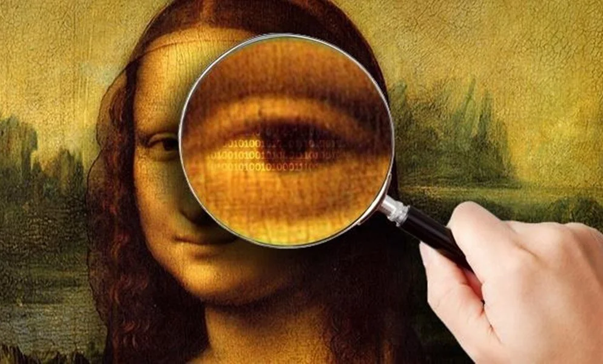
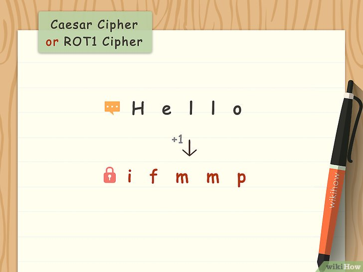
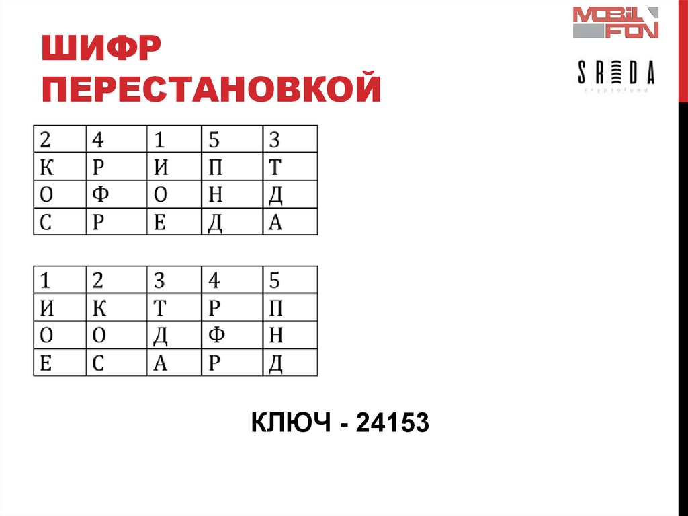
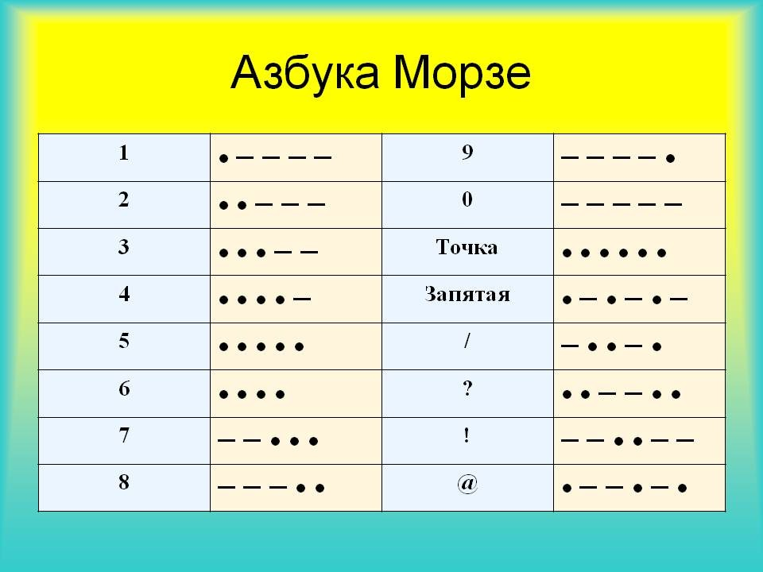
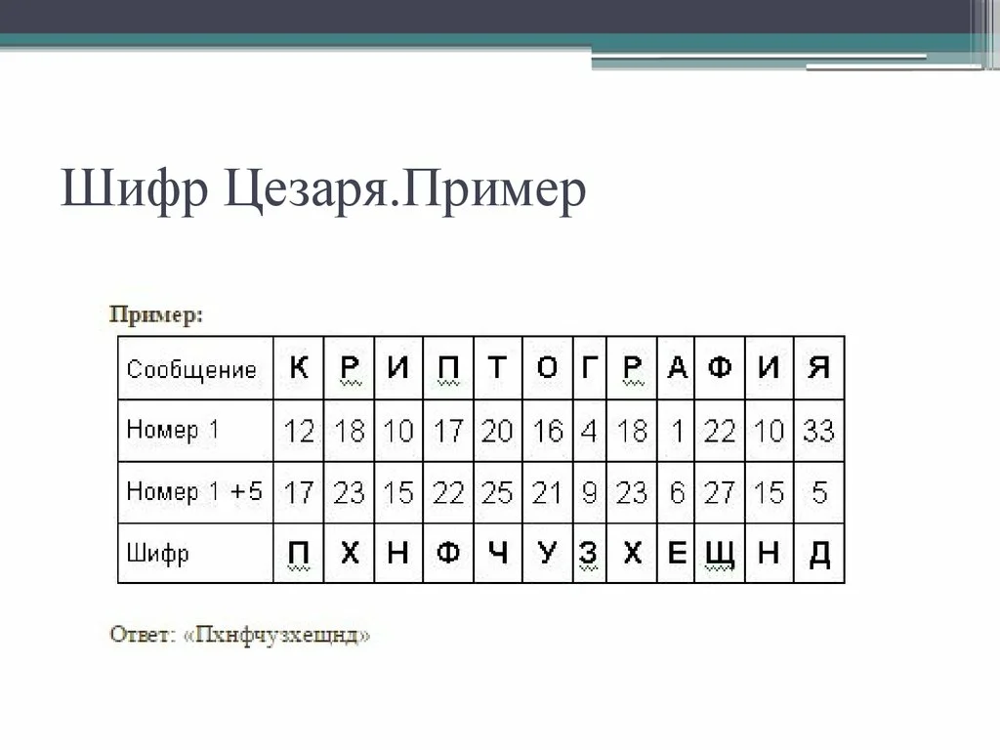
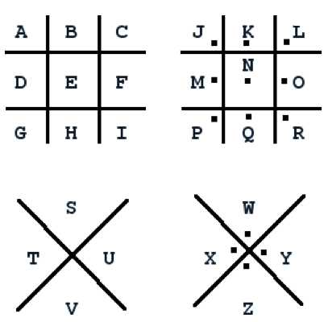
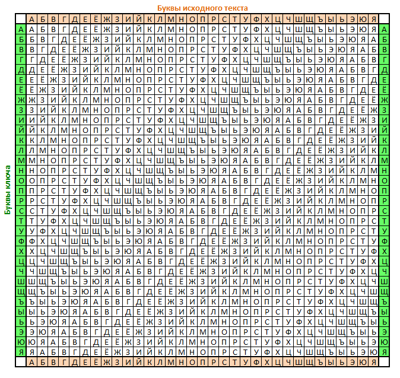
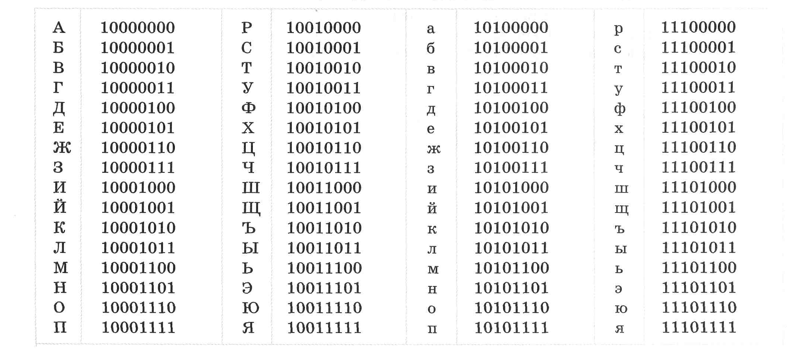
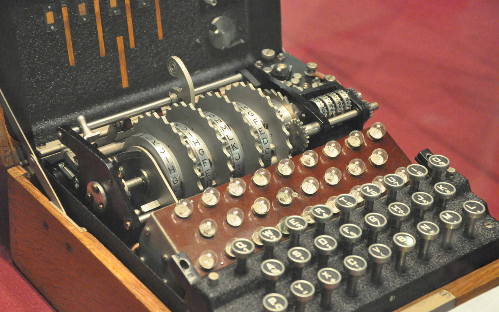
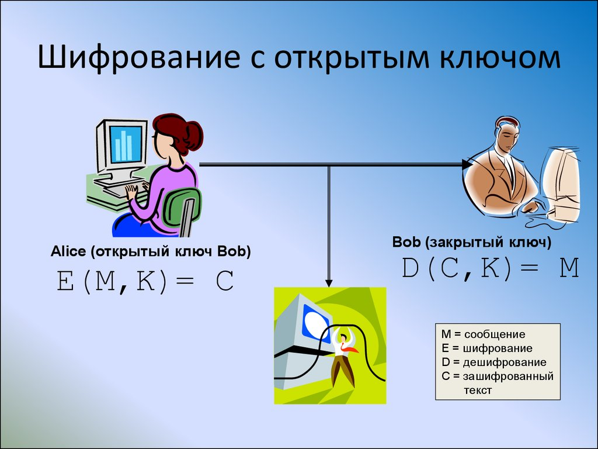

# Шифры и Коды
# Способы хранить и передавать информацию.
## 1й способ 

Обычно в древности когда людям нужно было передать что-то важное, они писали что-то на листке бумаги, покрывали ваксой и глотали с той целью, чтобы незаметно доставить его получателю. Лучше всего для стеганографии использовать повседневные объекты. Когда-то в Англии использовался такой метод: под некоторыми буквами на первой странице газеты стояли крохотные точки, почти невидимые невооруженным глазом. Если читать только помеченные буквы, то получится секретное сообщение! Некоторые писали сообщение первыми буквами составляющих его слов или использовали невидимые чернила. Была распространена практика уменьшения целых страниц текста до размера буквально одного пикселя, так что их было легко пропустить при чтении чего-то относительно безобидного. Стеганографию лучше всего использовать в сочетании с другими методами шифрования, так как всегда есть шанс, что ваше скрытое послание обнаружат и прочитают.
 
## 2й способ.

Это очень простой способ шифрования. каждая предыдущая буква заменяется на последующую. Например два слова I know будут после изменения этим "шифром" звучать как J lopx. 

## 3й способ.

В транспозиции был заранее определен алгоритм. Например в разных войнах люди передавали этим способом важные сведения. Например перестановка букв местами или переворачивание букв. 

## 4й способ.

Азбука Морзе — азбука, в которой буквы закодированы с помощью кода Морзе. Изначально использовалось название «Код Морзе», но с началом Первой мировой войны выросла необходимость передачи буквенных кодов, код стал называться азбукой. В разной справочной литературе можно встретить разный «набор» азбуки: с включением только букв или с включением также цифр и знаков препинания. Наравне с названиями «Код Морзе» и «Азбука Морзе» популярно также название «Морзянка». С учетом тематики нашего сайта детально будет показан только русский алфавит Морзе.

Код Морзе изобретен в 1838 году, назван в честь его создателя Сэмюэля Морзе. Первая депеша по способу Морзе была послана между Вашингтоном и Балтимором 24 мая 1844 года с текстом «Вот что творит Бог».

## 5й способ.

Шифр Цезаря — это вид шифра подстановки, в котором каждый символ в открытом тексте заменяется символом находящимся на некотором постоянном числе позиций левее или правее него в алфавите. Шифр назван в честь римского императора Гая Юлия Цезаря, использовавшего его для секретной переписки со своими генералами. Шаг шифрования, выполняемый шифром Цезаря, часто включается как часть более сложных схем, таких как шифр Виженера, и все ещё имеет современное приложение в системе ROT13. Как и все моноалфавитные шифры, шифр Цезаря легко взламывается и не имеет практически никакого применения на практике.

## 6й способ.

Шифр простой замены, простой подстановочный шифр, моноалфавитный шифр — класс методов шифрования, которые сводятся к созданию по определённому алгоритму таблицы шифрования, в которой для каждой буквы открытого текста существует единственная сопоставленная ей буква шифр-текста. Само шифрование заключается в замене букв согласно таблице. Для расшифровки достаточно иметь ту же таблицу, либо знать алгоритм, по которой она генерируется.

К шифрам простой замены относятся многие способы шифрования, возникшие в древности или средневековье, как, например, Атбаш (также читается как этбаш) или Шифр Цезаря. Для вскрытия подобных шифров используется частотный криптоанализ.

## 7й способ.

Метод является усовершенствованным шифром Цезаря, где буквы смещались на определенную позицию.
Шифр Виженера состоит из последовательности нескольких шифров Цезаря с различными значениями сдвига.

## 8й способ.

Данный метод подразумевает наличие некоторой книги с расшифровкой всего кода, где поясняется что за слово как кодируется. У этого метода была и есть одна проблема. Если книга с расшифровкой потеряется, код будет невозможно расшифровать только если человек не помнит содержания всей книги.

## 9 способ.

Энигма — это шифровальная машина, использовавшаяся нацистами во времена Второй Мировой. Принцип ее работы таков: есть несколько колес и клавиатура. На экране оператору показывалась буква, которой шифровалась соответствующая буква на клавиатуре. То, какой будет зашифрованная буква, зависело от начальной конфигурации колес.

Существовало более ста триллионов возможных комбинаций колес, и со временем набора текста колеса сдвигались сами, так что шифр менялся на протяжении всего сообщения.

## 10 способ.

Суть данного шифра заключается, как правило, в наличии двух ключей, один из которых передается публично, а второй является секретным (приватным). Открытый ключ используется для шифровки сообщения, а секретный — для дешифровки.

В роли открытого ключа чаще всего выступает очень большое число, у которого существует только два делителя, не считая единицы и самого числа. Вместе эти два делителя образуют секретный ключ.

